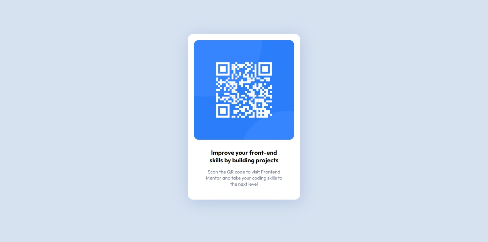

# Frontend Mentor - QR code component solution

This is a solution to the [QR code component challenge on Frontend Mentor](https://www.frontendmentor.io/challenges/qr-code-component-iux_sIO_H). Frontend Mentor challenges help you improve your coding skills by building realistic projects.

## Table of contents

- [Overview](#overview)
  - [Screenshot](#screenshot)
  - [Links](#links)
- [My process](#my-process)
  - [Built with](#built-with)
  - [Useful resources](#useful-resources)
- [Author](#author)
- [Acknowledgments](#acknowledgments)

## Overview

This is the solution to the challenge on Frontend Mentor which involves building a QR component using HTML and CSS only.

### Screenshot

### Links

- Live Site URL: [Add live site URL here](https://abhi-shek-qr-component.netlify.app/)

## My process

Created a card using multiple 
 and added simple CSS using classes and id selectors.

### Built with

- Semantic HTML5 markup
- CSS custom properties
- Flexbox
- Media Queries

### Useful resources

- [Example resource 1](https://www.w3schools.com/) - This sit helped me with the usage of CSS media queries.

## Author

- Website - [Add your name here](https://abhi-shek-qr-component.netlify.app/)
- Frontend Mentor - [@yourusername](https://www.frontendmentor.io/profile/Abhishek279-alt)
